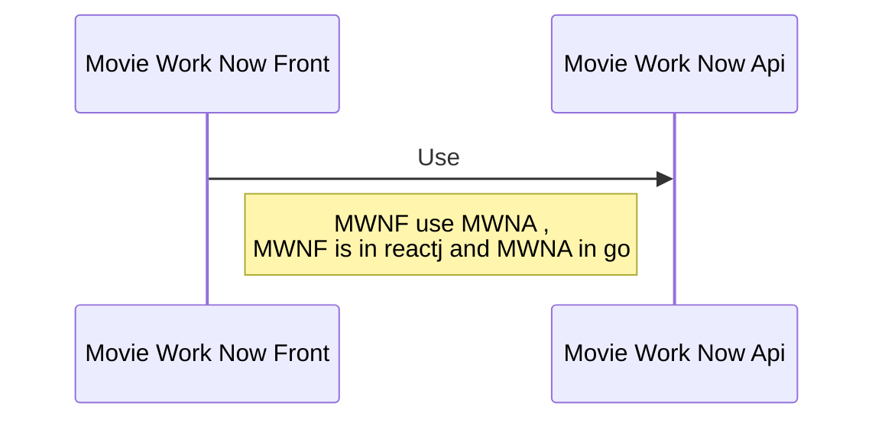

# HI! 

Hi! I'm  Elisa, this is my profile in github =D welcome.

# Projects

## Movie Work Now 

Movie Work Now api  (go lang) use:

to route ->  ECHO ->"github.com/labstack/echo/v4"

to storage errors -> BUGSNAG -> "github.com/bugsnag/bugsnag-go/v2"

to show in console information and errors -> LOG -> "github.com/labstack/gommon/log"

client Nosql -> MONGODB -> "go.mongodb.org/mongo-driver/mongo"

to encoded -> BSON -> "go.mongodb.org/mongo-driver/bson"

____________-> JSON -> "encoding/json"

Movie Work Now Front  (reactjs) use:

to request -> axios

react-router-dom

### schema
		

